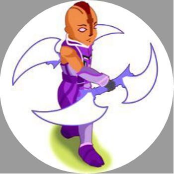

<body>
  

    

      

	
        <h1>Resolution</h1>
	
QQ: 451460424

	
Email: resolution_wanglf@163.com

      

      

    

    

      <ul class="artical-list">
        
        <li>
          <a href="{{ post.url }}" class="title">{{ post.title }}</a>
          
{{ post.description }}

        </li>
        
      </ul>
    

  

</body>
